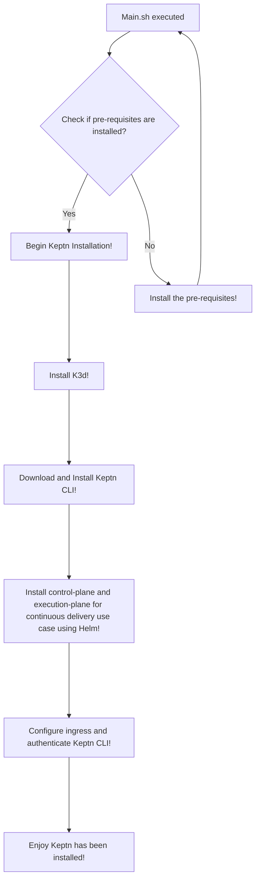

# Setup-Keptn-Using-Jenkins
The Keptn project began as a way to assist enterprises in adopting cloud-native strategies for either cutting-edge microservice applications or long-standing monoliths. This ecosystem has been evolving since its inception, focusing on robust continuous delivery with automated testing, quality gates, and auto-remediation capabilities. It now has over 50.

## Prerequisites
The following tools need to be installed for this tutorial:
```
Docker with minimum 4vCPUS, 12GB RAM, 20GB disk space left.
kubectl version >= 1.19
helm version >= 3.3.0
Git
```

## How to begin the Installation?
Just execute the main.sh file using this command using Jenkins pipeline on the host you want to deploy it on.
Rest script will handle everything :relaxed:
```
bash main.sh
```

The above command will do the following tasks:-

## Congratulations you have intalled Keptn !!
### You can now access the Web UI at http://127.0.0.1.nip.io:8082/bridge.

